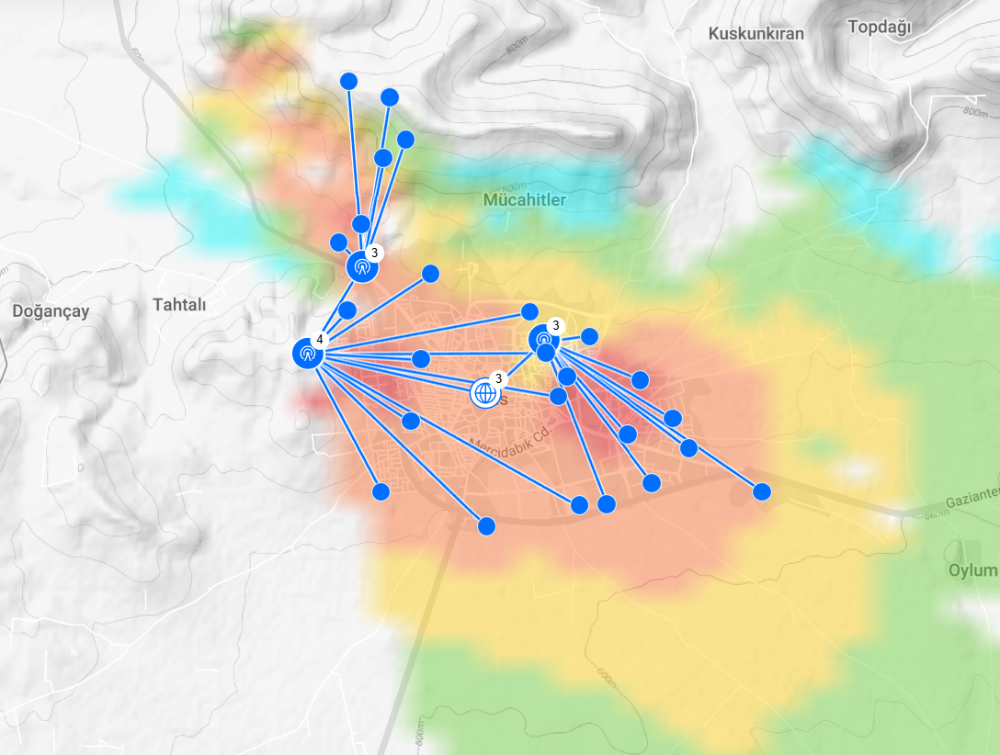
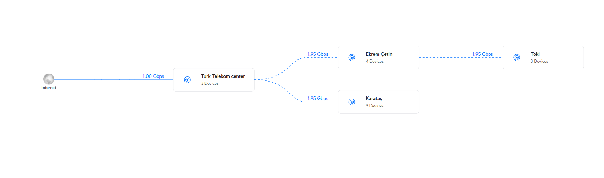
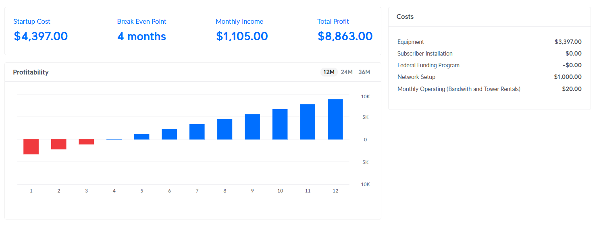

# Kilis Metro Wireless Infrastructure Design

### 1. Project Overview
A high-capacity **Fixed Wireless Access (FWA)** network engineered for Kilis, Turkey. This project simulates a professional ISP deployment bridging a 1.00 Gbps fiber gateway to high-density residential zones (Ekrem Çetin, Karataş, Toki) using the **Ubiquiti ISP Design Center**.

**View Project Design:** [UISP Design Center](https://ispdesign.ui.com/#p=76f41d5c9a184ed180e597db82b8a613)

---

### 2. Key Technical Specifications
* **Signal Target (CPE):** Optimized for **-55 dBm to -60 dBm** to maintain maximum modulation rates.
* **Backhaul Stability (PtP):** High-gain links stabilized at **-40 dBm to -50 dBm**.
* **Throughput:** 1.95 Gbps aggregate capacity for multi-device distribution hubs.
* **Terrain Strategy:** Node placement avoids obstructions to ensure clear Line of Sight (LoS) and an unobstructed first Fresnel zone for 60GHz signals.

---

### 3. Reliability & Risk Mitigation
* **Physical Integrity:** Mandatory use of **Shielded Twisted Pair (STP) CAT5e/CAT6** with 100% copper conductors and **ESD Drain Wires** to prevent port failure.
* **Weatherproofing:** Deployment of **Drip Loops** at all entry points and **12-15 dB Fade Margins** to account for heavy precipitation.
* **Spectral Management:**
	* **GPS Sync:** Enabled on LTU Rockets to eliminate self-interference.
    * **60 GHz Precision:** 100% Fresnel Zone clearance required for airFiber 60 LR units.
    * **TX/RX Balance:** High-gain antennas used to increase passive gain, allowing for lower Transmission (TX) power to reduce environmental noise.

---

### 4. Network Governance & Security
* **Subscriber Privacy:** **Client Isolation (AP Isolation)** enabled to prevent peer-to-peer traffic and broadcast storms between customers.
* **Management VLANs:** Administrative traffic is tagged and isolated from general subscriber data.
* **Legal Compliance:** Architecture supports centralized logging to comply with **Turkish Law No. 5651** (IP-to-Subscriber mapping).
* **Observability:** Managed via **UISP Controller** for proactive monitoring of SNR drops and capacity bottlenecks.

---

### 5. Financial Modeling & Profitability
The network is designed for rapid scalability with a lean CAPEX model. By offsetting CPE costs through installation fees, the project reaches a break-even point in approximately 4 months.

#### Project Economics (Based on 105 Subscribers)
| Metric | Monthly Value | Annual Total |
| :--- | :--- | :--- |
| **Gross Revenue** | $1,105.00 | $13,260.00 |
| **Operating Expenses (OPEX)** | $20.00 | $240.00 |
| **Net Profit** | **$1,105.00** | **$13,260.00** |

#### Hardware Inventory & CAPEX
| Category | Device | Quantity | Unit Price | Total Price |
| :--- | :--- | :---: | :---: | :---: |
| **Backhaul** | airFiber 60 LR | 6 | $299.00 | $1,794.00 |
| **AP Sector** | LTU-Rocket | 3 | $399.00 | $1,197.00 |
| **Routing**| UISP Router | 3 | $109.00 | $327.00 |
| **Switching**| UISP Switch | 1 | $79.00 | $79.00 |
| **Setup & Labor** | Installation/VAT | - | - | $1,000.00 |
| **Total Startup Cost**| | | | **$4,397.00** |

#### Service Plan Tiers
| Plan | Downlink | Uplink | Price per Month | Subscribers |
| :--- | :--- | :--- | :--- | :--- |
| **Plan 1** | 10 Mbps | 2 Mbps | $10.00 | 50 |
| **Plan 2** | 20 Mbps | 3 Mbps | $11.00 | 35 |
| **Plan 3** | 30 Mbps | 4 Mbps | $12.00 | 20 |

*Note: LTU-XR CPE units ($2,475 total) are excluded from CAPEX as they are covered by customer installation fees.*

### 6. Troubleshooting & Operational Scenarios

To demonstrate readiness for field operations, this section outlines the standard operating procedures (SOP) for common RF issues in the Kilis deployment.

#### Scenario: 10dB Signal Drop on 60GHz Backhaul
A sudden 10dB drop on a 60GHz link is a critical event due to the narrow beamwidth and oxygen absorption characteristics of the band.

**Step 1: Check Weather Data (UISP/Local Reports)**
* **Analysis:** 60GHz is susceptible to "Rain Fade." If heavy precipitation is present, the 5GHz failover link should be checked for active traffic.
* **Action:** If rain is not the cause, proceed to Step 2.

**Step 2: Delta Analysis (Expected vs. Actual)**
* **Analysis:** Compare current RSSI to the baseline "Expected Signal" calculated during the design phase. A 10dB delta usually indicates a physical change.
* **Action:** Inspect for hardware misalignment caused by high wind loads or loose mounting brackets.

**Step 3: Fresnel Zone & Obstruction Check**
* **Analysis:** At 60GHz, even a growing tree branch or new temporary construction (e.g., a crane) entering the Fresnel zone will cause significant attenuation.
* **Action:** Perform a visual LoS (Line of Sight) audit from the tower.

**Step 4: Thermal/Power Audit**
* **Analysis:** Check internal device temperatures and PoE voltage in UISP. Overheating or voltage drops (common with poor quality CCA cables) can cause radio front-end instability.
* **Action:** Validate that **Shielded CAT6** and **ESD Grounding** are intact to rule out static damage to the radio port.

---

### 7. Day-1 Maintenance Checklist
* **[ ] Alignment Optimization:** Peak all dishes to within 1-2 dB of design targets.
* **[ ] Capacity Stress Test:** Run bidirectional UDP tests to verify 1.95 Gbps backhaul limits.
* **[ ] Failover Verification:** Manually disable a 60GHz link to ensure 5GHz backup takes over within < 1 second.
* **[ ] Security Audit:** Confirm **Client Isolation** is active and management VLANs are unreachable from subscriber IPs.

---
**Tech Stack:** `Ubiquiti UISP` | `RF Planning` | `GIS Analysis` | `Network Topology` | `Law 5651 Compliance`
